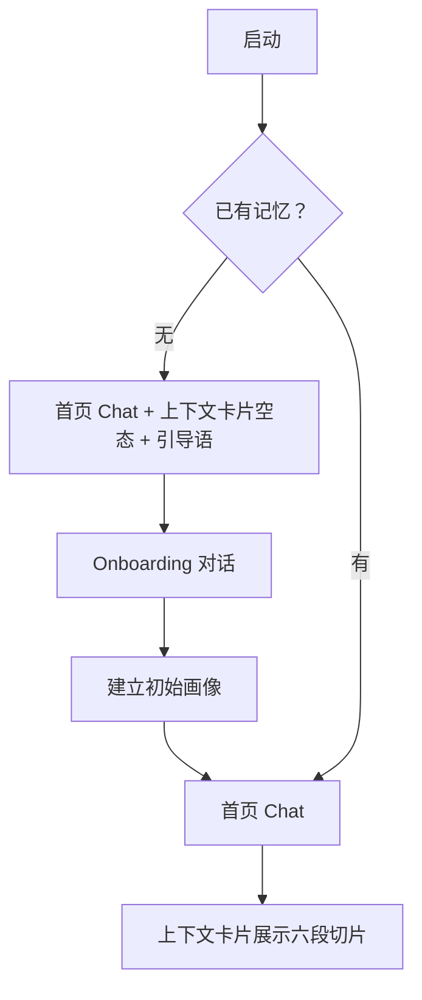
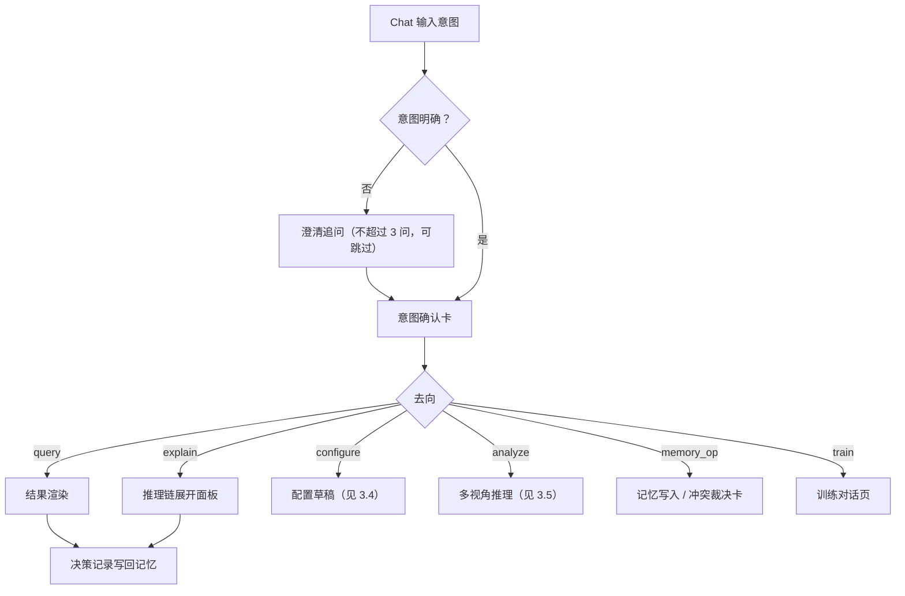
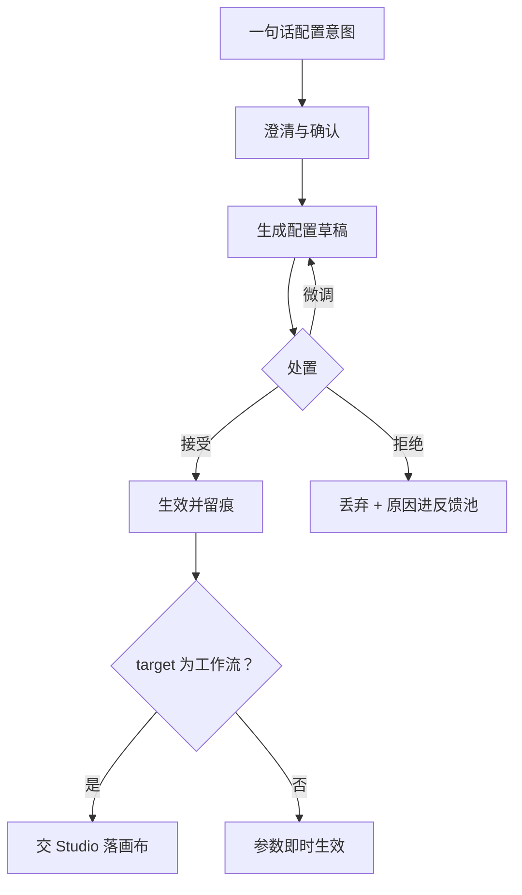
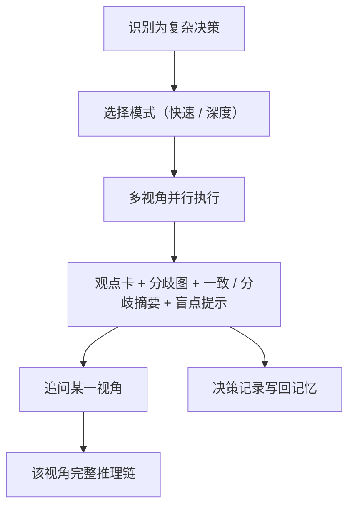
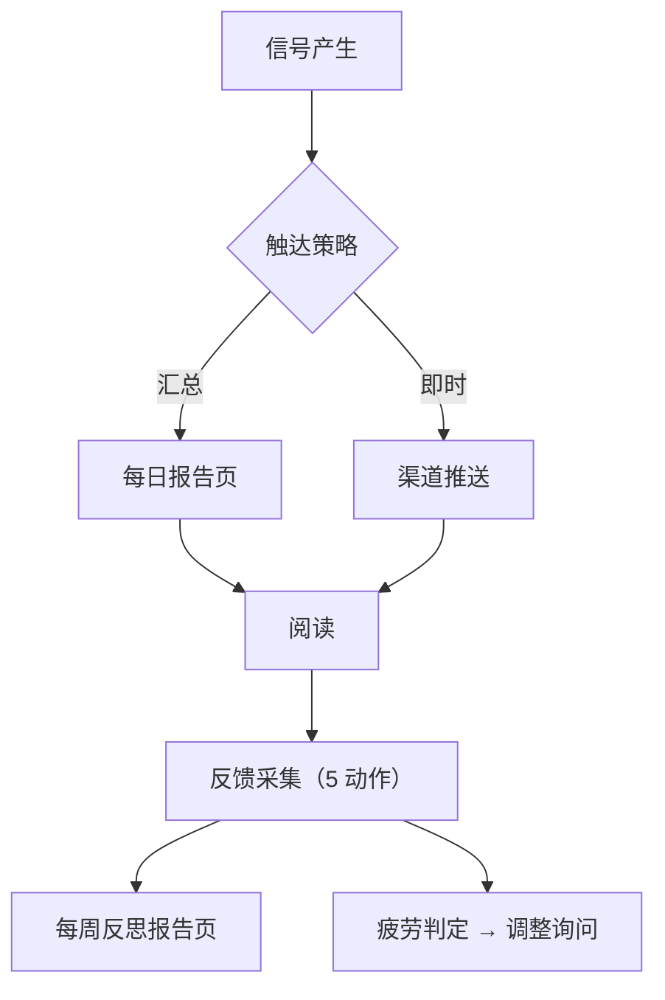
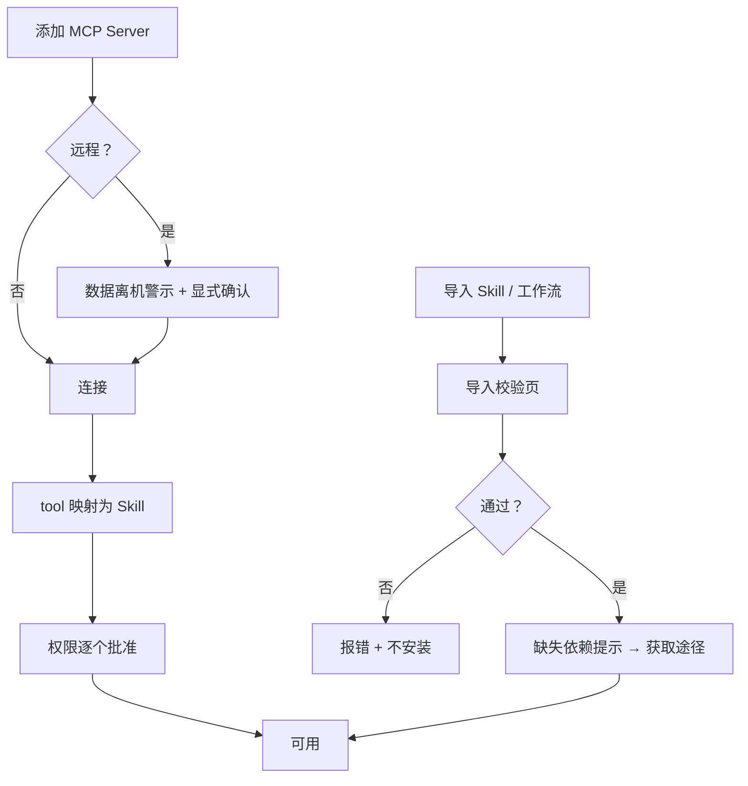
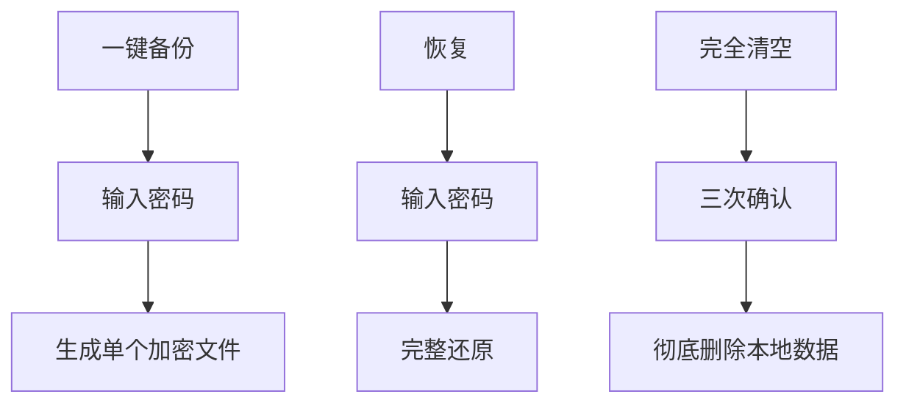
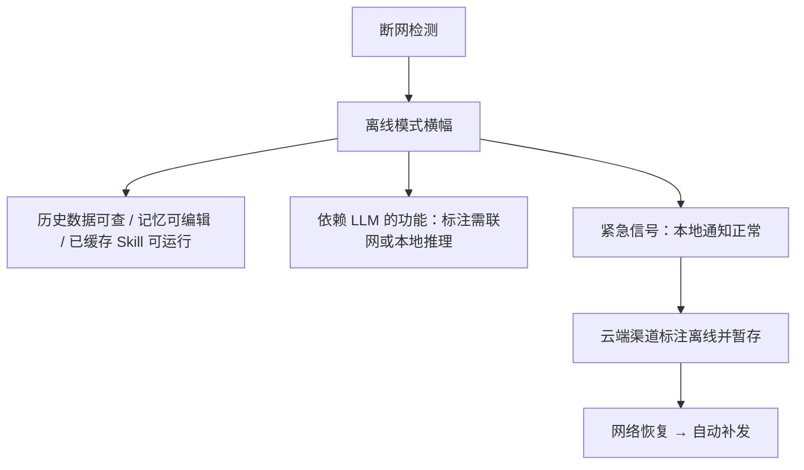

# 站点地图（IA 骨架）与页面 Flow

> 本文件兑现 [README.md](README.md) 的「待生成」占位（`:107-108`），作为表现层（[T-UI-001](../../项目管理/tasks/done/M1/T-UI-001-表现层骨架与本地服务通信面.md) 线）的**权威 IA 输入**。
> 组织口径：产品首页＝Chat，**无传统菜单式入口层级**（[story-01](story-01-chat-as-os.md)）；非对话类能力以「对话为主 + 少量全局区」组织。
> 形态约束：后端常驻、UI 为可分离客户端（[00 §1.1](../技术架构-v2/00-架构总览.md)）；页面集**不预设壳形态**（桌面壳延后，见 D-060）。
> 文案口径：页面文案（引导语、空状态、确认卡、按钮）一律按[契约 9 中性表达](10-platform-capabilities.md)撰写，**不出现拟人化措辞**（人名 / 性格 / 第一人称 / 情感 / 对话体）。

## 1 全局形态

- **唯一主入口＝Chat**：全部能力原则上都可从对话触达；对话流是页面组织的主干。
- **辅助区**：非对话类页面（记忆 / 能力 / 推理 / 触达 / 反思 / 设置）从上下文卡片、结果组件与全局入口进入，不构成独立菜单层级。
- **全局常驻要素**：离线模式横幅、网络活动入口。
- **不在本页面集内**：壳的原生呈现面（原生窗口 / 托盘 / 自启 / 原生通知），其归属见 [T-UI-002](../../项目管理/tasks/T-UI-002-桌面壳与打包.md)。

## 2 页面清单

> 每页括注承载 Story。页面集＝10 个 story「设计触点 · 屏」清单的归并，双向可追溯（见 [§4](#4-与-story-的对应)）。

### Chat 主界面

（[story-01](story-01-chat-as-os.md)）

- Chat 主界面（首页）：对话流 + 输入框 + 首开引导语，**不显示传统菜单**
- 上下文卡片（常驻首页）：六段——持仓摘要 / 关注池 / 未读告警 / 近期热点 / 当前 thesis / 风险偏好；非 ok 段以「不可用 + 原因」呈现，不静默留空；无记忆时空态引导 Onboarding
- 澄清追问对话框：关键参数追问，**不超过 3 个**，每问可跳过（用默认值继续）
- 意图确认卡：澄清收敛后列出理解条目供确认
- 快捷指令菜单：`/` 触发（/盯盘 /回测 /压测 /今日看板 /反思）
- Generative UI 容器：对话内按需生成看板 / 图表 / 卡片 / 回测报告，含「钉」入口
- 推理链展开面板：从任意结论卡进入（Flow 见 [§3.3](#33-推理链展开)）

### 工作区

（[story-01](story-01-chat-as-os.md)）

- 钉住的持久组件：看板 / 图表 / 卡片 / 回测报告；支持刷新 / 下钻（跳转推理链或 Skill 详情）/ 取消钉住

### 记忆

（[story-03](story-03-memory-graph.md)；自 Chat 上下文卡片的「进入完整图谱」落地）

- 图谱视图 / 列表视图 / 时间线视图：三种组织共享同一查询层
- 偏好画像卡：「当前画像」摘要，**不超过 5 条**关键标签
- 节点详情页 / 修正历史页：修正保留旧值供审计
- 导入导出面板：导出前显示「本次包含哪些信息」清单 + 确认门
- Onboarding 对话：建立初始画像（风险偏好 / 投资年限 / 关注板块）

### 能力

（[story-02](story-02-skills-runtime.md) / [story-06](story-06-skill-studio.md) / [story-08](story-08-mcp-hub.md) / [story-10](story-10-skill-sharing.md)）

- Skill 库浏览页 / Skill 详情页 / Skill 参数配置面板 / Skill 执行日志页（story-02）
- Studio 主画布 / Skill 参数面板 / 工作流属性面板 / 调试控制台 / 版本历史页 / 模板库 / 导入导出对话框（story-06）
- MCP Hub 主页 / Server 列表 / Server 详情页 / 权限确认对话框 / tool schema 浏览器（story-08）
- Skill 库-导入导出面板 / 导出对话框（隐私过滤）/ 导入校验页 / 官方 Skill 索引浏览页 / 来源追溯页 / 异常行为警示对话框（story-10）

### 推理

（[story-04](story-04-multi-lens.md)）

- Deliberation 触发确认对话框：快速模式（3 视角）/ 深度模式（7 视角）
- 多视角并行执行进度页
- 分歧图矩阵视图 / 证据网络图视图
- 视角详情页 / 追问对话框 / 自定义视角创建页
- 决策记录页：决策 + 理由 + 采纳视角 + 忽略视角

### 触达

（[story-07](story-07-ambient-delivery.md)）

- 每日报告页 / 推送历史时间线
- 注意力预算配置页 / 渠道配置页 / 情境模式切换器
- 推送疲劳反馈对话框

### 反思

（[story-09](story-09-reflection-loop.md)）

- 每周反思报告页（4 段式）/ 反馈采集组件
- 训练对话页 / 主动提案卡片
- A/B 实验日志页 / 变更历史时间线 / 演进授权设置页

### 设置

（[story-05](story-05-local-first.md)；网络活动面板与 story-08 共用）

- 设置-存储页 / 设置-LLM 提供方页 / 设置-数据源页 / 设置-隐私页
- 备份 / 恢复对话框；完全清空确认流程（三次确认）
- 网络活动面板

### 全局要素

- 离线模式横幅（[story-05](story-05-local-first.md)）
- 网络活动面板（[story-05](story-05-local-first.md) 与 [story-08](story-08-mcp-hub.md) 共用，入口常驻）

## 3 页面 Flow

> Flow 只描述页面与对话框之间的走向；各态的语义（`ok` / `empty` / `unavailable` / `dependency_failed` / `failed` / `validation_failed`）见[契约 5 结构化输出](10-platform-capabilities.md)与 [05 §4](../技术架构-v2/05-L3-对话主入口.md)。

### 3.1 首次启动

### 3.2 用户发起（反向流）

### 3.3 推理链展开

> 该面板**跨页复用**：同一渲染件同时服务本 Flow、[§3.5](#35-多视角决策闭环) 的视角追问与[反思报告](story-09-reflection-loop.md)。

### 3.4 对话即配置

> 未经确认的卡不生成草稿（`validation_failed`）。

### 3.5 多视角决策闭环

### 3.6 主动触达与反馈

### 3.7 能力挂载与导入

### 3.8 备份 / 恢复 / 清空

### 3.9 离线降级

## 4 与 Story 的对应

| Story | 承载分区 | 屏清单出处 |
|---|---|---|
| [story-01 Chat-as-OS](story-01-chat-as-os.md) | [Chat 主界面](#chat-主界面) · [工作区](#工作区) | `story-01:55` |
| [story-02 Skills Runtime](story-02-skills-runtime.md) | [能力](#能力) | `story-02:70` |
| [story-03 Memory Graph](story-03-memory-graph.md) | [记忆](#记忆) | `story-03:63` |
| [story-04 Multi-Lens](story-04-multi-lens.md) | [推理](#推理) | `story-04:74` |
| [story-05 本地优先](story-05-local-first.md) | [设置](#设置) · [全局要素](#全局要素) | `story-05:58` |
| [story-06 Skill Studio](story-06-skill-studio.md) | [能力](#能力) | `story-06:60` |
| [story-07 Ambient Delivery](story-07-ambient-delivery.md) | [触达](#触达) | `story-07:60` |
| [story-08 MCP Hub](story-08-mcp-hub.md) | [能力](#能力) · [设置](#设置)（网络活动） | `story-08:54` |
| [story-09 Reflection Loop](story-09-reflection-loop.md) | [反思](#反思) | `story-09:60` |
| [story-10 Skill 分享](story-10-skill-sharing.md) | [能力](#能力) | `story-10:55` |

## 5 未纳入本 IA

- **壳的原生呈现面**（原生窗口 / 托盘 / 自启 / 原生通知）——归 [T-UI-002](../../项目管理/tasks/T-UI-002-桌面壳与打包.md)。
- **异常态系统穷举**（离线 / LLM 不可用 / MCP Server 崩溃 / 本地存储损坏 / 演进漂移等）——[README](README.md) 预留新增 `12-edge-cases.md`；本文件的 §3.9 只覆盖离线一条主干。
- **量化指标与度量方案**——[README](README.md) 明示另立文档。
