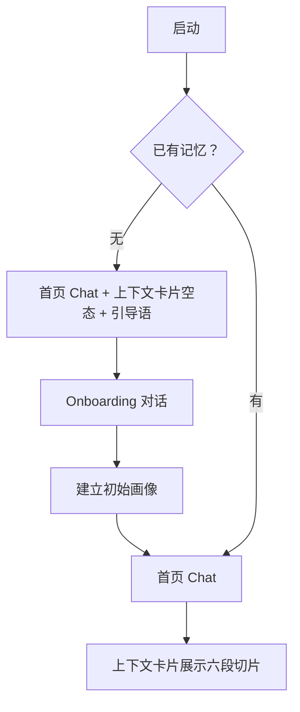
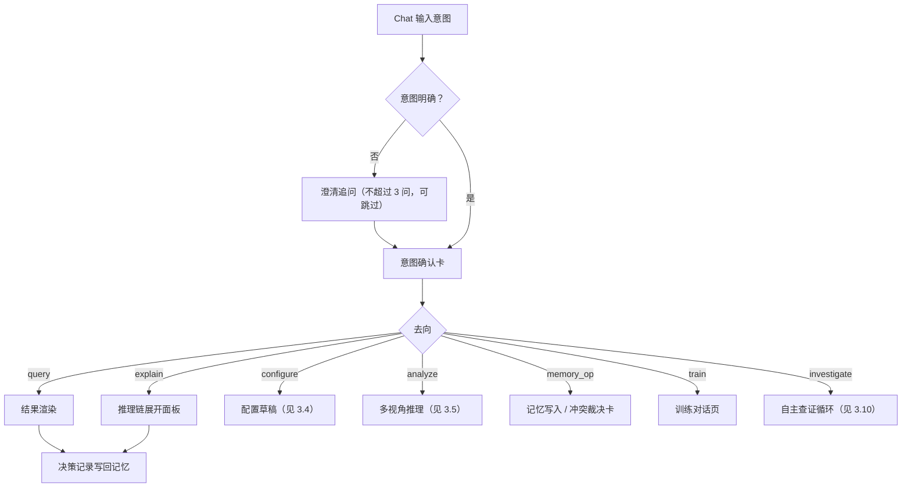
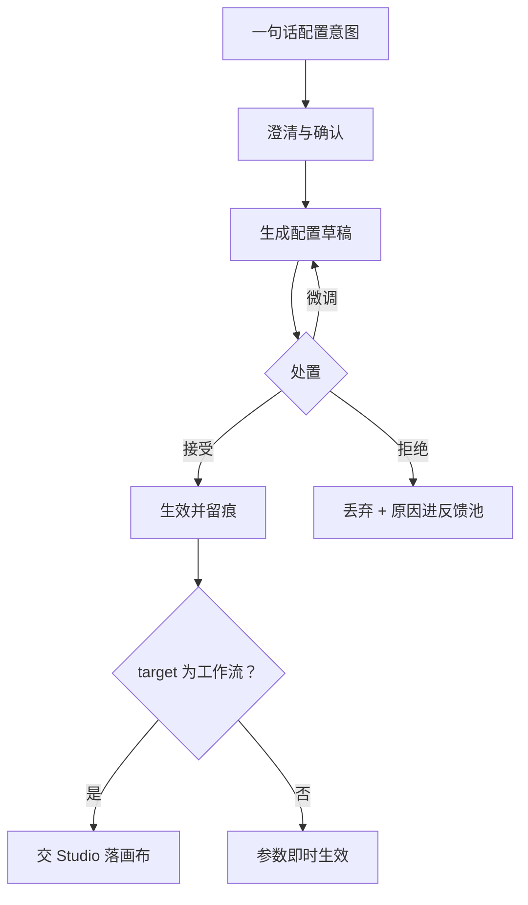
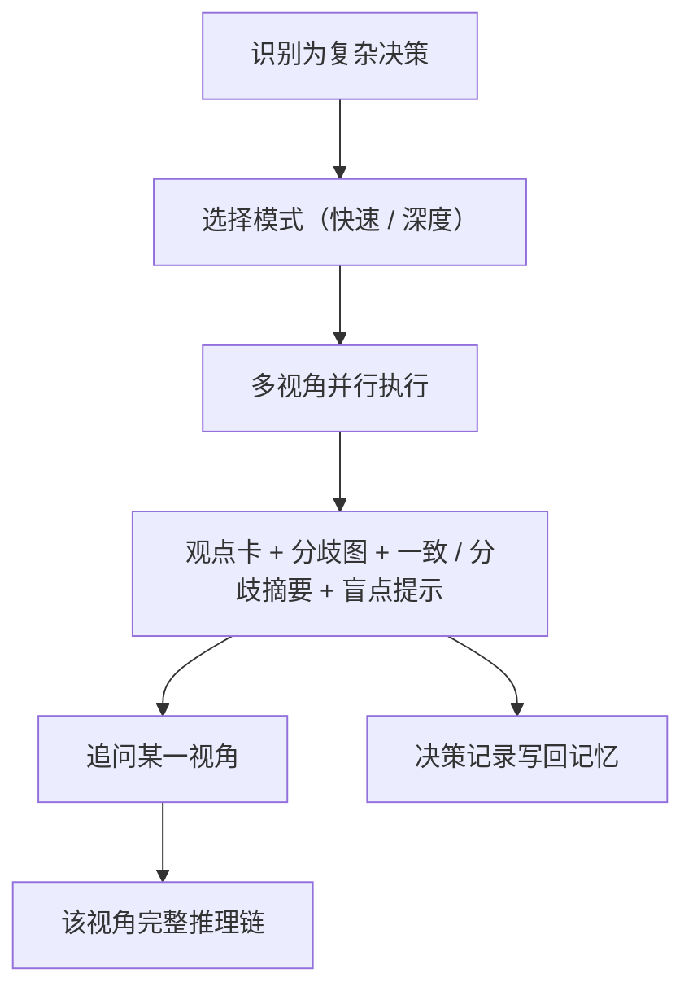
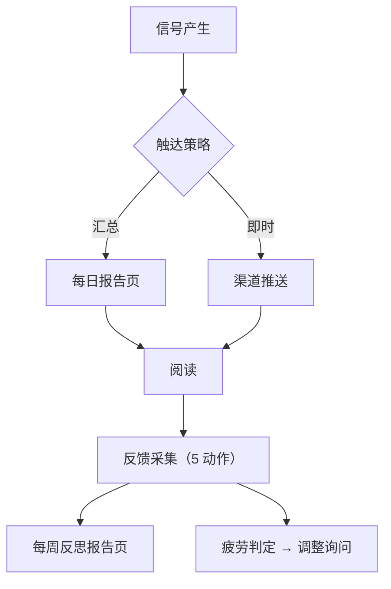
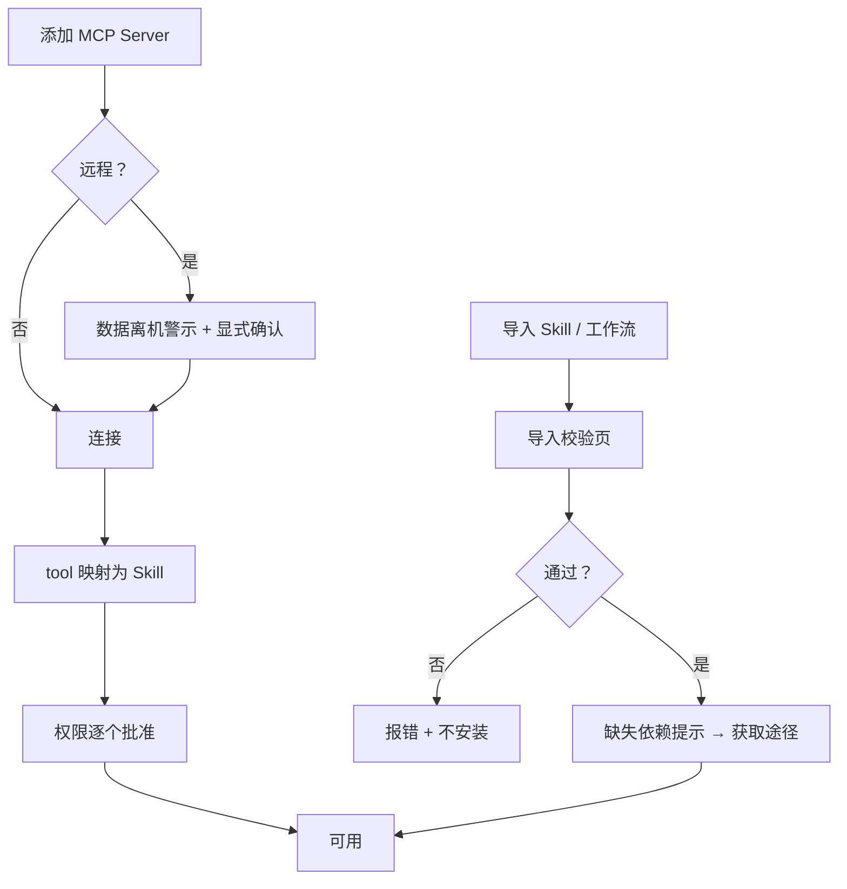
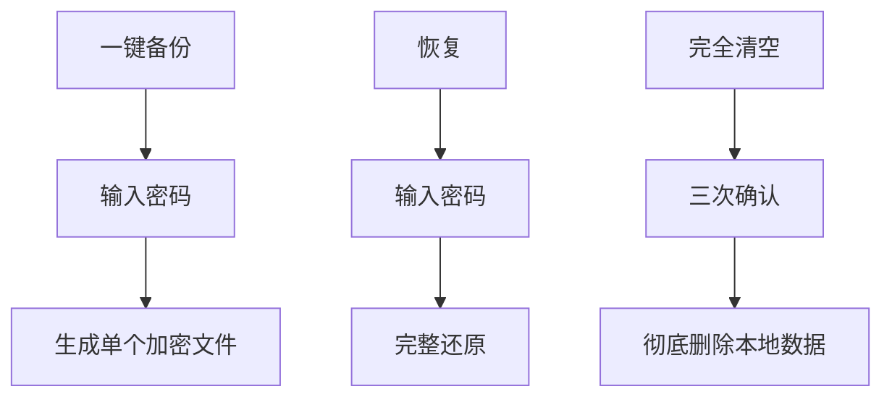
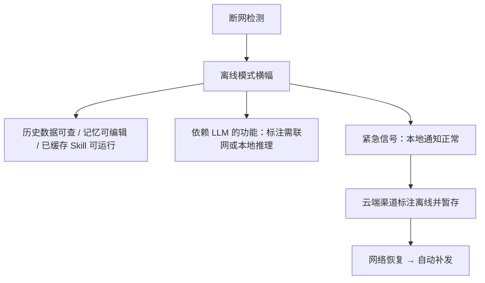
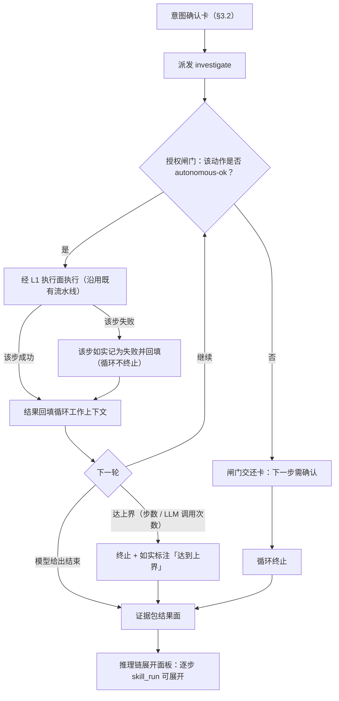

# 站点地图（IA 骨架）与页面 Flow

> 本文件兑现 [README.md](README.md) 的「待生成」占位（`:107-108`），作为表现层（[T-UI-001](../../项目管理/tasks/done/M1/T-UI-001-表现层骨架与本地服务通信面.md) 线）的**权威 IA 输入**。
> 组织口径：产品首页＝Chat，**无传统菜单式入口层级**（[story-01](story-01-chat-as-os.md)）；非对话类能力以「对话为主 + 少量全局区」组织。
> 形态约束：后端常驻、UI 为可分离客户端（[00 §1.1](../技术架构-v2/00-架构总览.md)）；页面集**不预设壳形态**（桌面壳延后，见 D-060）。
> 文案口径：页面文案（引导语、空状态、确认卡、按钮）一律按[契约 9 中性表达](10-platform-capabilities.md)撰写，**不出现拟人化措辞**（人名 / 性格 / 第一人称 / 情感 / 对话体）。

## 1 全局形态

- **唯一主入口＝Chat**：全部能力原则上都可从对话触达；对话流是页面组织的主干。
- **辅助区**：非对话类页面（记忆 / 能力 / 推理 / 触达 / 反思 / 设置）从上下文卡片、结果组件与全局入口进入，不构成独立菜单层级。
- **全局常驻要素**：离线模式横幅、网络活动入口。
- **视觉**：配色 / 字体 / 版式与 18 型组件的视觉基线见 [13-visual-design.md](13-visual-design.md)——**本册只定「有哪些页、页间怎么走」，不重复定视觉**。
- **不在本页面集内**：壳的原生呈现面（原生窗口 / 托盘 / 自启 / 原生通知），其归属见 [T-UI-002](../../项目管理/tasks/done/M3/T-UI-002-桌面壳与打包.md)。

## 2 页面清单

> 每页括注承载 Story。页面集＝10 个 story「设计触点 · 屏」清单的归并，双向可追溯（见 [§4](#4-与-story-的对应)）。

### Chat 主界面

（[story-01](story-01-chat-as-os.md)）

- Chat 主界面（首页）：对话流 + 输入框 + 首开引导语，**不显示传统菜单**
- 上下文卡片（常驻首页）：六段——持仓摘要 / 关注池 / 未读告警 / 近期热点 / 当前 thesis / 风险偏好；非 ok 段以「不可用 + 原因」呈现，不静默留空；无记忆时空态引导 Onboarding
- 澄清追问对话框：关键参数追问，**不超过 3 个**，每问可跳过（用默认值继续）
- 意图确认卡：澄清收敛后列出理解条目供确认
- 快捷指令菜单：`/` 触发（/盯盘 /回测 /压测 /今日看板 /反思）
- Generative UI 容器：对话内按需生成看板 / 图表 / 卡片 / 回测报告，含「钉」入口
- 推理链展开面板：从任意结论卡进入（Flow 见 [§3.3](#33-推理链展开)）

### 工作区

（[story-01](story-01-chat-as-os.md)）

- 钉住的持久组件：看板 / 图表 / 卡片 / 回测报告；支持刷新 / 下钻（跳转推理链或 Skill 详情）/ 取消钉住

### 受控自主

（[story-01](story-01-chat-as-os.md)；`investigate` 意图的运行时面——契约见 [05 §10](../技术架构-v2/05-L3-对话主入口.md)，走向见 [§3.10](#310-自主查证循环)）

- 证据包结果面：多步查证的结构化结果——各步 `skill_run` 输出与引用清单；经既有 Generative UI 容器渲染（**不另造渲染路径**），含「钉」入口
- 完整 Trace：循环每步各产一条 `skill_run`，故逐步可展开——复用 [§3.3](#33-推理链展开) 的推理链展开面板，不重复定义；**模型为何选下一步不外显**（[05 §10](../技术架构-v2/05-L3-对话主入口.md) 的中间推理边界）
- 闸门交还卡：「下一步需确认」的显式告知——列出已收集的证据与那一步未执行的原因；**不静默跳过、不把半程结果呈现为已完成**
- 终止与上界标注：终止原因（模型给出结束 / 达上界 / 闸门交还）与已用步数 / LLM 调用次数如实标注——达上界时记「达到上界」，**不假装完成**
- 失败步标注：单个工具失败的步骤**照实呈现为失败**并与其余步骤并列（循环不因此终止），**不呈现为成功**
- 降级告知面：端点不支持工具调用或不可用时走 `unavailable` + 显式降级文案，**不静默退回** `query` 的确定性路径

### 记忆

（[story-03](story-03-memory-graph.md)；自 Chat 上下文卡片的「进入完整图谱」落地）

- 图谱视图 / 列表视图 / 时间线视图：三种组织共享同一查询层
- 偏好画像卡：「当前画像」摘要，**不超过 5 条**关键标签
- 节点详情页 / 修正历史页：修正保留旧值供审计
- 导入导出面板：导出前显示「本次包含哪些信息」清单 + 确认门
- Onboarding 对话：建立初始画像（风险偏好 / 投资年限 / 关注板块）

### 能力

（[story-02](story-02-skills-runtime.md) / [story-06](story-06-skill-studio.md) / [story-08](story-08-mcp-hub.md) / [story-10](story-10-skill-sharing.md)）

- Skill 库浏览页 / Skill 详情页 / Skill 参数配置面板 / Skill 执行日志页（story-02）
- Studio 主画布 / Skill 参数面板 / 工作流属性面板 / 调试控制台 / 版本历史页 / 模板库 / 导入导出对话框（story-06）
- MCP Hub 主页 / Server 列表 / Server 详情页 / 权限确认对话框 / tool schema 浏览器（story-08）
- Skill 库-导入导出面板 / 导出对话框（隐私过滤）/ 导入校验页 / 官方 Skill 索引浏览页 / 来源追溯页 / 异常行为警示对话框（story-10）

### 推理

（[story-04](story-04-multi-lens.md)）

- Deliberation 触发确认对话框：快速模式（3 视角）/ 深度模式（7 视角）
- 多视角并行执行进度页
- 分歧图矩阵视图 / 证据网络图视图
- 视角详情页 / 追问对话框 / 自定义视角创建页
- 决策记录页：决策 + 理由 + 采纳视角 + 忽略视角

### 触达

（[story-07](story-07-ambient-delivery.md)）

- 每日报告页 / 推送历史时间线
- 注意力预算配置页 / 渠道配置页 / 情境模式切换器
- 推送疲劳反馈对话框

### 反思

（[story-09](story-09-reflection-loop.md)）

- 每周反思报告页（4 段式）/ 反馈采集组件
- 训练对话页 / 主动提案卡片
- A/B 实验日志页 / 变更历史时间线 / 演进授权设置页

### 设置

（[story-05](story-05-local-first.md)；网络活动面板与 story-08 共用）

- 设置-存储页 / 设置-LLM 提供方页 / 设置-数据源页 / 设置-隐私页
- 备份 / 恢复对话框；完全清空确认流程（三次确认）
- 网络活动面板

### 全局要素

- 离线模式横幅（[story-05](story-05-local-first.md)）
- 网络活动面板（[story-05](story-05-local-first.md) 与 [story-08](story-08-mcp-hub.md) 共用，入口常驻）

### 2.1 屏 → 呈现形态对位（M6 契约先行）

> 本表是 [01 §12](../技术架构-v2/01-平台共享契约.md) 枚举面的**消费视图**：把 §2 声明的每条屏 / 面归到一种呈现形态。四类归属——
>
> - **复用**：用已实现的组件型（[01 §12](../技术架构-v2/01-平台共享契约.md) 本期登记并实现表）
> - **新登记并实现** / **预留升实现**：本批补的形态，渲染件与视觉基线同批落地
> - **非组件型面**：**不是**生成式组件——① **页面**（其内容由若干组件型组成，页面路径见 §2.2）；② **壳面**（对话流宿主 / 输入面 / 全局 chrome，不属描述体系）；③ **对话流内面**（L3 协议模型直出，持 `ResultEnvelope` 而无 `component_type`，见 [`l3/intent/protocol.py`](../../src/st_agent/l3/intent/protocol.py)）；④ **呈现档**（[01 §5](../技术架构-v2/01-平台共享契约.md) 六态由服务端下发，非组件）

| 分区 | 屏 / 面 | 形态归属 | 判据 / 出处 |
|---|---|---|---|
| Chat 主界面 | Chat 主界面（首页）对话流 + 输入框 + 首开引导语 | 非组件型：**壳面** | 对话流宿主与输入面，不属描述体系（归 [`T-UI-012`](../../项目管理/tasks/T-UI-012-Chat主界面对话流与生成式UI宿主.md)） |
| Chat 主界面 | 上下文卡片（六段） | 复用 `context_card` | [05 §2](../技术架构-v2/05-L3-对话主入口.md) 的六段固定卡 |
| Chat 主界面 | 澄清追问对话框 | 非组件型：**对话流内面** | `ClarificationRound` 持 `ResultEnvelope` 而无 `component_type` |
| Chat 主界面 | 意图确认卡 | 非组件型：**对话流内面** | `IntentConfirmation` 同上；条目列表即 `ConfigDraft` 摘要的同一副本 |
| Chat 主界面 | 快捷指令菜单（`/`） | 非组件型：**壳面** | 输入面的补全清单，非页面产物 |
| Chat 主界面 | Generative UI 容器（含「钉」入口） | 非组件型：**壳面** | 容器是宿主；「钉」是容器动作，**不进描述**（[01 §12](../技术架构-v2/01-平台共享契约.md)） |
| Chat 主界面 | 推理链展开面板 | 复用 `trace_timeline` | [05 §7](../技术架构-v2/05-L3-对话主入口.md) |
| 工作区 | 钉住的持久组件（看板 / 图表 / 卡片 / 回测报告） | 复用（**描述序列**） | [01 §5](../技术架构-v2/01-平台共享契约.md) 的 `data` 可为**描述序列**——看板＝`heatmap` + `trend_chart` + `table` 并置；`pinned_board` **保留预留**（看板是序列，不是另一种结构型） |
| 受控自主 | 证据包结果面 | 复用 `table` / `report_card` | [05 §10](../技术架构-v2/05-L3-对话主入口.md)：结构化证据包交**既有**渲染路径 |
| 受控自主 | 完整 Trace | 复用 `trace_timeline` | 循环每步各产一条 `skill_run`，逐步展开复用同一渲染件 |
| 受控自主 | 闸门交还卡 | 复用 `report_card` | [05 §10](../技术架构-v2/05-L3-对话主入口.md)：多段式陈述（已收集证据 / 那一步未执行的原因） |
| 受控自主 | 终止与上界标注 | 复用 `report_card` | 段：终止原因 / 已用步数 / LLM 调用次数；达上界记「达到上界」 |
| 受控自主 | 失败步标注 | 复用 `trace_timeline` | 每步状态如实呈现，失败步与其余步并列 |
| 受控自主 | 降级告知面 | 非组件型：**呈现档** | [01 §5](../技术架构-v2/01-平台共享契约.md) 的 `unavailable` + 中性降级文案（不静默退回 `query`） |
| 记忆 | 图谱视图 | **新登记并实现** `graph_view` | 节点-边图在枚举面**无对应型**（`divergence_map` 的 `network` 对位「分歧」语义且与 `matrix` 同为必填） |
| 记忆 | 列表视图 | 复用 `table` | 三视图共享同一查询层，列表即二维表 |
| 记忆 | 时间线视图 | **新登记并实现** `timeline_view` | 既有两型皆不可复用（`change_timeline` 字段硬编码对位「演进变更」、`trace_timeline` 对位「推理步骤」） |
| 记忆 | 偏好画像卡（≤5 标签） | 复用 `report_card` | ≤5 条关键标签作段内容；风险偏好徽标是**段内单元级装饰**，`risk_badge` **保留预留** |
| 记忆 | 节点详情页 | 复用 `report_card` | 逐项并列（类型 / 置信度 / 隐私分级 / 来源） |
| 记忆 | 修正历史页 | **`timeline_view`** | 逐条原值 / 新值 / 时刻；story-03 定为**只读审计** |
| 记忆 | 导入导出面板 | 复用 `permission_approval_card` | 导出前清单 + 确认门（[09 §3](../技术架构-v2/09-生态与分享.md)） |
| 记忆 | Onboarding 对话 | 非组件型：**对话流内面** | L2 `OnboardingProtocol` 的问答轮次，非生成式产物 |
| 能力 | Skill 库浏览页 | 复用 `table` | 逐条并列 |
| 能力 | Skill 详情页 | 复用 `report_card` | 多段式陈述 |
| 能力 | Skill 参数配置面板 | 复用 `config_draft_card`（只读）/ `setting_panel`（带动作） | 两型分工见 [01 §12](../技术架构-v2/01-平台共享契约.md) |
| 能力 | Skill 执行日志页 | 复用 `table` | 逐条留痕 |
| 能力 | Studio 主画布 | 复用 `studio_canvas` | [05 §6](../技术架构-v2/05-L3-对话主入口.md) / story-06 |
| 能力 | Studio Skill 参数面板 / 工作流属性面板 | 复用 `setting_panel` / `config_draft_card` | 同上两型分工 |
| 能力 | 调试控制台 | 复用 `table` + `report_card` | 逐条留痕 + 小结 |
| 能力 | 版本历史页 | 复用 `timeline_view` | 逐条时序 |
| 能力 | 模板库 | 复用 `table` / `report_card` | `TemplateSummary` 逐条并列（[05 §6](../技术架构-v2/05-L3-对话主入口.md)） |
| 能力 | 导入导出对话框 / Skill 库-导入导出面板 / 导出对话框（隐私过滤） | 复用 `permission_approval_card` | 逐项批准 + 确认门 |
| 能力 | MCP Hub 主页 / Server 列表 | 复用 `table` | 逐条并列 |
| 能力 | Server 详情页 | 复用 `report_card` | 多段式陈述 |
| 能力 | 权限确认对话框 | 复用 `permission_approval_card` | [03 §5.1](../技术架构-v2/03-L1-能力底座-Skills与MCP.md) |
| 能力 | tool schema 浏览器 | 复用 `table` | 逐字段并列 |
| 能力 | 导入校验页 | 复用 `report_card` | 逐条校验结果 + 缺失依赖提示 |
| 能力 | 官方 Skill 索引浏览页 | 复用 `table` | 逐条并列 |
| 能力 | 来源追溯页 | 复用 `trace_timeline` | 来源链为**链式逐条**（[09 §4](../技术架构-v2/09-生态与分享.md)） |
| 能力 | 异常行为警示对话框 | 复用 `violation_alert` | story-10 |
| 推理 | Deliberation 触发确认对话框 | 非组件型：**对话流内面** | 查清协议的问项来自**意图级参数声明**（[05 §3.2](../技术架构-v2/05-L3-对话主入口.md)） |
| 推理 | 多视角并行执行进度页 | 复用 `report_card` | 逐视角状态**并列**，非 ok 段显式原因 |
| 推理 | 分歧图矩阵视图 / 证据网络图视图 | 复用 `divergence_map` | [06 §5](../技术架构-v2/06-L4-多视角推理.md)：两视图均实现，描述里逐格并列、不合并 |
| 推理 | 视角详情页 | 复用 `report_card` + `trace_timeline` | 观点卡 + 该视角完整推理链（[06 §6](../技术架构-v2/06-L4-多视角推理.md)） |
| 推理 | 追问对话框 | 非组件型：**对话流内面** | 同上 |
| 推理 | 自定义视角创建页 | 复用 `setting_panel` / `config_draft_card` | 逐项配置 + 应用动作 |
| 推理 | 决策记录页 | 复用 `report_card` | 决策 + 理由 + 采纳视角 + 忽略视角，**并列不合并**（[铁律 4](../../项目管理/工程宪法.md)） |
| 触达 | 每日报告页 | 复用 `report_card` | 多段式；趋势 / 热力段走 `trend_chart` / `heatmap` |
| 触达 | 推送历史时间线 | **`timeline_view`** | 逐条时序（同型的第二个消费区，见「跨区复用」注） |
| 触达 | 注意力预算配置页 / 渠道配置页 / 情境模式切换器 | 复用 `setting_panel` | 候选项 + 应用动作 |
| 触达 | 推送疲劳反馈对话框 | 复用 `feedback_capture` | 五类动作按钮组（[08 §1](../技术架构-v2/08-L6-反思演进.md)） |
| 反思 | 每周反思报告页（4 段式） | 复用 `report_card` | [08 §2](../技术架构-v2/08-L6-反思演进.md) |
| 反思 | 反馈采集组件 | 复用 `feedback_capture` | 同上 |
| 反思 | 训练对话页 | 非组件型：**对话流内面** | 训练对话协议（[08 §3](../技术架构-v2/08-L6-反思演进.md)） |
| 反思 | 主动提案卡片 | 复用 `proposal_card` | [08 §3–§4](../技术架构-v2/08-L6-反思演进.md) |
| 反思 | A/B 实验日志页 | 复用 `table` | 逐条并列 |
| 反思 | 变更历史时间线 | 复用 `change_timeline` | [08 §5–§6](../技术架构-v2/08-L6-反思演进.md)（逐条变更 + 回滚，写路径内置） |
| 反思 | 演进授权设置页 | 复用 `setting_panel` | [08 §5](../技术架构-v2/08-L6-反思演进.md) |
| 设置 | 设置-存储页 / LLM 提供方页 / 数据源页 / 隐私页 | 复用 `setting_panel` | 逐条设置 + 应用动作（[01 §7](../技术架构-v2/01-平台共享契约.md)） |
| 设置 | 备份 / 恢复对话框 | 复用 `permission_approval_card` | 输入密码 + 确认门（[02 §8](../技术架构-v2/02-L0-本地优先基座.md)） |
| 设置 | 完全清空确认流程（三次确认） | 复用 `permission_approval_card` | 三次确认即**逐步批准**面；破坏性动作不静默 |
| 设置 | 网络活动面板 | 复用 `table` | 逐条出网留痕（[02 §6](../技术架构-v2/02-L0-本地优先基座.md)；与全局要素共用一屏） |
| 全局要素 | 离线模式横幅 | 非组件型：**壳面** | 全局 chrome，由呈现档驱动 |
| 全局要素 | 网络活动面板 | 见「设置」行 | 同一条屏，两处入口 |

**跨区复用**（本表新增两型的两条理由）：

- `graph_view` 服务**记忆**区图谱视图——它是三视图里**唯一**无既有型可承接的（列表走 `table`、时间线走 `timeline_view`）。
- `timeline_view` 服务**记忆**（时间线视图 / 修正历史页）与**触达**（推送历史时间线）**两区**——同形而跨区，故另立一型而非为每页各造一套（[铁律 3](../../项目管理/工程宪法.md) 的可配置性取向：不重复定义）。

**本表之外**：壳的原生呈现面（窗口 / 托盘 / 自启 / 原生通知）与异常态系统穷举见 §5；二者的归属不因本表改变。

### 2.2 屏 → 页面路径与导航模型

> §2.1 定「每条屏是什么形态」，本表定「**哪些屏是页面、落在哪个路径**」。两条口径：
>
> - **只给页面配路径**——§2.1 判为**壳面 / 对话流内面 / 呈现档**的屏**不落路径**，它们在主入口 `/` 内承载。
> - **一屏一路径不等于分区一路径**——同一分区下的多个屏按**页内视图 / 查询串**聚合到一条路径（先例：`/eco` 一条 + 其子面三条；`/reflection` 一条 + 其子面三条）。故**不引入动态段**——[`PAGE_PATHS`](../../src/st_agent/ui/app.py) 是**精确匹配**集合。

| 分区 | 页面路径 | 承载的屏（§2.1） | 状态 |
|---|---|---|---|
| Chat 主界面 | `/` | 对话流 / 上下文卡片 / 生成式容器 / 推理链面板 / 快捷指令菜单 / 澄清追问 / 意图确认卡 / Onboarding 对话 / 受控自主 6 条面 / 各对话流内面 | 既有 |
| 工作区 | `/workspace` | 钉住的持久组件（看板 / 图表 / 卡片 / 回测报告） | **待登记** |
| 记忆 | `/memory` | 图谱视图 / 列表视图 / 时间线视图（**页内视图切换**）· 偏好画像卡 · 节点详情（`?node=<id>`）· 修正历史（`?node=<id>&view=revisions`）· 导入导出面板 | 既有 |
| 能力 | `/skills` | Skill 库浏览 / 详情 / 参数配置面板 / 执行日志页 | **待登记** |
| 能力 | `/studio` | Studio 主画布 / 参数面板 / 工作流属性面板 / 调试控制台 / 版本历史 / 模板库 | 既有 |
| 能力 | `/mcp` | MCP Hub 主页 / Server 列表 / Server 详情 / 权限确认对话框 / tool schema 浏览器 | **待登记** |
| 能力 | `/eco` | 导入导出对话框 / Skill 库-导入导出面板 / 导出对话框（隐私过滤） | 既有 |
| 能力 | `/eco/import` | 导入校验页 | 既有 |
| 能力 | `/eco/index` | 官方 Skill 索引浏览页 | 既有 |
| 能力 | `/eco/imports` | 来源追溯页 | 既有 |
| 能力 | `/eco/security` | 异常行为警示对话框 | 既有 |
| 推理 | `/deliberation` | 多视角并行执行进度页 / 分歧图矩阵视图 / 证据网络图视图 / 视角详情页 / 自定义视角创建页 / 决策记录页（触发确认对话框与追问对话框是**对话流内面**，不落此路径） | **待登记** |
| 触达 | `/delivery` | 每日报告页 / 推送历史时间线 / 注意力预算配置页 / 渠道配置页 / 情境模式切换器 / 推送疲劳反馈对话框 | **待登记** |
| 反思 | `/reflection` | 每周反思报告页 / 反馈采集组件 / 主动提案卡片（训练对话页是**对话流内面**；演进授权设置页落在 `/settings/evolution`，见末行） | 既有 |
| 反思 | `/reflection/changes` | 变更历史时间线 | 既有 |
| 反思 | `/reflection/experiments` | A/B 实验日志页 | 既有 |
| 反思 | `/reflection/training` | 训练与回访留痕 | 既有 |
| 设置 | `/settings` | 设置-存储页 / LLM 提供方页 / 数据源页 / 隐私页 / 备份恢复对话框 / 完全清空确认流程 / 网络活动面板 | **待登记** |
| 反思 → 设置 | `/settings/evolution` | 演进授权设置页（§2 归「反思」分区，路径取既有设置前缀——**不更名**，见 §2.2 口径的「不重排既有路由」） | 既有 |

**导航模型口径**（与 §1「无传统菜单式入口层级」的调和）：

- **主入口恒为 `/`（Chat）**——[§1](#1-全局形态) 的声明不变：全部能力原则上可从对话触达，对话流是页面组织的主干。
- **`nav` 是辅助区的扁平入口，不是菜单层级**——它是 §1「全局入口」一条的**可视化**：一屏一条、不分级、不展开子菜单。故「有 `nav`」与「无传统菜单式入口层级」并不冲突：层级来自**多级展开**，而 `nav` 是**一层平铺**。
- **顶层项按分区根聚合**——子面（`/reflection/changes`、`/eco/import` 等）**不占** `nav` 顶层项，由所在页内的导航与结果组件进入（上下文卡片 ⇒ 完整图谱、结论卡 ⇒ 推理链，即 §1 声明的进入方式）。
- **壳的路由机制不动**——精确匹配 + SPA 回退 + 令牌分档（[D-063](../../项目管理/决策日志.md)）不变；带标识的面走**查询串**（`/memory?node=…`），故路径集仍是有限字面量集合。

**欠账去向**（本表「待登记」六条的承接方）：[`T-UI-011`](../../项目管理/tasks/T-UI-011-底座与骨架多面端口注入与全IA页面登记.md)（底座与骨架：全 IA 页面登记与多面端口注入）——把 `PAGE_PATHS` / [`pages.js`](../../src/st_agent/ui/web/js/pages.js) 补至本表全集，并把 `nav` 由「列全部登记项」收敛为「按分区根聚合」。机器侧由 [`tests/ui/test_ui_shell_routing.py`](../../tests/ui/test_ui_shell_routing.py) 的漂移断言兜底（现有路径不得超出本表声明集），故**新增路径不可能悄悄绕过本表**。

## 3 页面 Flow

> Flow 只描述页面与对话框之间的走向；各态的语义（`ok` / `empty` / `unavailable` / `dependency_failed` / `failed` / `validation_failed`）见[契约 5 结构化输出](10-platform-capabilities.md)与 [05 §4](../技术架构-v2/05-L3-对话主入口.md)。

### 3.1 首次启动

### 3.2 用户发起（反向流）

### 3.3 推理链展开

> 该面板**跨页复用**：同一渲染件同时服务本 Flow、[§3.5](#35-多视角决策闭环) 的视角追问、[§3.10](#310-自主查证循环) 的逐步展开与[反思报告](story-09-reflection-loop.md)。

### 3.4 对话即配置

> 未经确认的卡不生成草稿（`validation_failed`）。

### 3.5 多视角决策闭环

### 3.6 主动触达与反馈

### 3.7 能力挂载与导入

### 3.8 备份 / 恢复 / 清空

### 3.9 离线降级

### 3.10 自主查证循环

> 入口接 [§3.2](#32-用户发起反向流)：`investigate` 在意图确认后经该 Flow 的「去向」派发到本循环。出口接 [§3.3](#33-推理链展开)：证据包里的每一步各是一条 `skill_run`，逐步展开复用同一渲染件。
> **交还即终止**——本期不做循环挂起与恢复（[05 §10](../技术架构-v2/05-L3-对话主入口.md)）；用户若仍要推进那一步属新一轮交互（[§3.2](#32-用户发起反向流) 的走向），故本 Flow 不画恢复边。
> 闸门与[反思](story-09-reflection-loop.md)面的「演进授权」**共用同一张风险清单**、档位彼此独立（[05 §10](../技术架构-v2/05-L3-对话主入口.md)）。

## 4 与 Story 的对应

| Story | 承载分区 | 屏清单出处 |
|---|---|---|
| [story-01 Chat-as-OS](story-01-chat-as-os.md) | [Chat 主界面](#chat-主界面) · [工作区](#工作区) · [受控自主](#受控自主) | `story-01:55` |
| [story-02 Skills Runtime](story-02-skills-runtime.md) | [能力](#能力) | `story-02:70` |
| [story-03 Memory Graph](story-03-memory-graph.md) | [记忆](#记忆) | `story-03:63` |
| [story-04 Multi-Lens](story-04-multi-lens.md) | [推理](#推理) | `story-04:74` |
| [story-05 本地优先](story-05-local-first.md) | [设置](#设置) · [全局要素](#全局要素) | `story-05:58` |
| [story-06 Skill Studio](story-06-skill-studio.md) | [能力](#能力) | `story-06:60` |
| [story-07 Ambient Delivery](story-07-ambient-delivery.md) | [触达](#触达) | `story-07:60` |
| [story-08 MCP Hub](story-08-mcp-hub.md) | [能力](#能力) · [设置](#设置)（网络活动） | `story-08:54` |
| [story-09 Reflection Loop](story-09-reflection-loop.md) | [反思](#反思) | `story-09:60` |
| [story-10 Skill 分享](story-10-skill-sharing.md) | [能力](#能力) | `story-10:55` |

## 5 未纳入本 IA

- **壳的原生呈现面**（原生窗口 / 托盘 / 自启 / 原生通知）——归 [T-UI-002](../../项目管理/tasks/done/M3/T-UI-002-桌面壳与打包.md)。
- **异常态系统穷举**（离线 / LLM 不可用 / MCP Server 崩溃 / 本地存储损坏 / 演进漂移等）——[README](README.md) 预留新增 `12-edge-cases.md`；本文件的 §3.9 只覆盖离线一条主干。
- **量化指标与度量方案**——[README](README.md) 明示另立文档。
- **受控自主循环的内部过程**（模型为何选下一步 / 工具选择过程）——**按设计不呈现**，不是缺章：`investigate` 循环的中间推理一律不外显（[05 §10](../技术架构-v2/05-L3-对话主入口.md)），页面只承载证据、Trace 与终止标注。同属「本期不做」的检索增强 / 子 Agent 上下文隔离 / 并行工具调用等亦不在页面集内。
