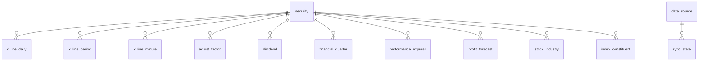

# 00 设计总览

## 定位

本数据库是 ST Agent 的**本地市场数据层**：以 BaoStock 为首个数据源，将行情、财务、公司报告、板块、宏观五类数据落库为本地 SQLite 单文件数据库，供全部 Skill 共享同一份数据源、避免口径不一。它是产品「本地优先数据主权」基座的数据承载，与 PRD 中「首次运行联网抓取建立本地缓存、之后可离线访问」的能力要求对齐。

- 不做实时行情库：数据新鲜度以公开市场数据可得的更新频率为准，契约见 [05-同步策略与新鲜度契约.md](05-同步策略与新鲜度契约.md)。
- 不承载用户数据（记忆图谱、偏好、对话）——那是独立的运行时存储，与本层解耦。
- 多源扩展是设计约束而非现状：公告、龙虎榜、股东、舆情等源未来接入时的规约见下文「多源扩展规约」。

## 设计原则

1. **单一事实源（Single Source of Truth）**：每张表只有一个写入来源（一个同步任务），全库口径唯一。所有 Skill 只读本层数据，不直连外部 API 做分析计算。
2. **只存不复权原始行情 + 复权因子**：日线仅落 `adjustflag=3`（不复权）数据，前/后复权价由 `adjust_factor` 经视图（`v_k_line_daily_hfq` / `v_k_line_daily_qfq`）按 BaoStock 涨跌幅复权法推导。避免同一事实三种口径存储导致的漂移，存储减半。
3. **规范化建模**：证券、交易日历为核心实体表；财务六接口合并为一张按 `(code, stat_date)` 对齐的宽表；板块成分保留历史快照而非只留最新。
4. **Agent 优先的可读性**：主键直接使用 BaoStock 代码格式（`sh.600000`）作为字符串主键，免去代理键换算；表名、列名与 API 字段名保持可追溯映射（见 [06-API映射契约.md](06-API映射契约.md)）。
5. **同步状态即元数据**：每张数据表都有对应的同步任务登记在 `sync_state`，Agent 可通过查询元数据判断数据新鲜度与完整性，而非盲目信任数据存在。
6. **可执行优先**：全部 DDL 汇总于 [schema.sql](schema.sql)，已通过实际建库、插入样例数据、视图推导一致性验证，任何 Agent 可直接执行。

## 分层与数据域

| 层 | 文档 | 表 | 说明 |
| --- | --- | --- | --- |
| 核心实体层 | [01-核心实体层.md](01-核心实体层.md) | `security`、`trade_calendar` | 源无关的全局唯一事实，其余所有表的父表 |
| 行情域 | [02-行情数据层.md](02-行情数据层.md) | `k_line_daily`、`k_line_period`、`k_line_minute`、`adjust_factor`、`dividend` + 4 个视图 | 价格量额与股本事件 |
| 财务与公司报告域 | [03-财务与公司报告层.md](03-财务与公司报告层.md) | `financial_quarter`、`performance_express`、`profit_forecast` | 季频指标宽表与披露事件 |
| 板块与宏观域 | [04-板块与宏观层.md](04-板块与宏观层.md) | `stock_industry`、`index_constituent`、`macro_*` × 5 | 分类快照与宏观时间序列 |
| 元数据层 | [05-同步策略与新鲜度契约.md](05-同步策略与新鲜度契约.md) | `data_source`、`sync_state`、`indicator_dictionary` | 数据源注册、同步水位、指标语义字典 |

## 全库约定

### 命名与类型

- 表名：`<域前缀>_<实体>`。行情域直接用 `k_line_*`，财务/公司报告无前缀（历史习惯），宏观域前缀 `macro_`；视图前缀 `v_`。
- 列名：由 API 字段名转为 snake_case（如 `pctChg` → `pct_chg`、`peTTM` → `pe_ttm`）；同义指标跨接口合并时以语义命名（如 `dupont_asset_turn`）。完整映射见 [06-API映射契约.md](06-API映射契约.md)。
- 日期一律 `TEXT`，格式 `YYYY-MM-DD`（字典序即时间序）；分钟线时间戳 `YYYY-MM-DD HH:MM:SS`。
- 数值一律 `REAL`（成交量 `INTEGER`，单位股）。**入库不做四舍五入**，保留源精度（价格 4 位、比率 6 位），由消费方按需取整。
- 布尔/枚举一律 `INTEGER` + `CHECK` 约束，取值沿用 API 口径。

### 清洗约定（全局规则）

| 源现象 | 规则 |
| --- | --- |
| 空字符串 `""` | 统一清洗为 `NULL`（如停牌日换手率） |
| 前导 `—` 负号（如 `—3.071550`） | 替换为 `-` 后转数值 |
| 「或」多值文本（如税后股利 `0.6813或0.71915`） | 取**第一个**数值，规则固定不可配置；描述性原文保留在文本列（`dividend.divid_cash_stock`） |
| 数字精度 | 不截断、不补零，原样落库 |
| 指数行的个股专属指标（如 `turn`、`is_st`） | 源即为空，按 `NULL` 落库 |

### 复权口径

- `back_adjust_factor` 定义：除权除息日最近一个交易日的前收盘价 ÷ 除权除息日前一交易日的收盘价。
- 后复权：`价格 × Π(除权日 ≤ 当日的 back_adjust_factor)`；前复权：`价格 × Π(除权日 > 当日的 fore_adjust_factor)`。
- 该推导保证复权后的日涨跌幅与源 `pct_chg` 完全一致（涨跌幅复权法的定义性质），视图实现见 [schema.sql](schema.sql)，验证案例见 [02-行情数据层.md](02-行情数据层.md)。

## 多源扩展规约

后续接入公告、龙虎榜、股东变化、舆情等源时：

1. **核心实体表永远单份**：新源的证券代码一律映射进 `security` 主档（`sh./sz.` 格式），不另建证券表。
2. **异构数据域 → 新建表组**：按域前缀命名（如 `announcement`、`dragon_tiger`、`sentiment`），复用 `sync_state` 同步机制与本文档族的分层结构。
3. **同域替代源 → 独立源表 + 聚合视图**：若新源与 BaoStock 提供同域同语义数据（如另一家行情源），新建独立表并以 `v_` 聚合视图对外提供统一读取面，**不修改既有表结构**；只有当聚合证明语义一致后才可考虑合并迁移。
4. **每个新源必须先在 `data_source` 注册**，并在 [05-同步策略与新鲜度契约.md](05-同步策略与新鲜度契约.md) 登记同步任务与新鲜度契约。

## 与平台共享契约的映射

本数据库是技术架构文档族中 [L0 本地优先基座](../技术架构-v2/02-L0-本地优先基座.md) `data_cache` 分区的首个落地形态。与 [平台共享契约](../技术架构-v2/01-平台共享契约.md) 的对应关系：

| 共享契约概念 | 本库落地 |
| --- | --- |
| `stock_id`（跨源统一证券标识） | `security.code`（`sh./sz.` 格式主键）；后续数据源的代码一律映射进 `security` 主档（见「多源扩展规约」） |
| `dataset_snapshot_id`（数据一致性锚点） | `sync_state` 各任务的 `(task_key, last_success_at, watermark)` 组合；一次分析所依据的快照即其读取各域数据时的水位集合 |
| `as_of`（结论基于的数据快照时间） | 按数据域取该域数据实际截止时间（如行情域 = `max(trade_date)`），陈旧判据见 [05-同步策略与新鲜度契约.md](05-同步策略与新鲜度契约.md) |
| ResultEnvelope `unavailable` 分支 | 新鲜度自检非空 → 上层走 `unavailable` 并标注最后更新时间，禁止旧数据冒充新数据 |
| 数据源逐个可开关 | 开关状态属配置注册表（01 §7）职责，不落数据库；本库仅登记 `data_source` 与 `sync_state` 任务状态 |

## 与产品架构的关系

- 本层位于六层 Agent Runtime 的 [L0 本地优先基座](../技术架构-v2/02-L0-本地优先基座.md)（`data_cache` 分区），为 L2 记忆图谱、L4 多视角推理、L5 主动触达提供统一的行情/财务事实查询面。
- L5 主动 Agent 的「定时扫描」即周期性执行 [07-典型查询模式.md](07-典型查询模式.md) 中的筛选类 SQL；触发时机以 [05-同步策略与新鲜度契约.md](05-同步策略与新鲜度契约.md) 的数据新鲜度契约为前置条件。
- 上层（Skill / 视角 / 报告）读取本层数据时统一经 L0 数据缓存查询面，输出按共享契约包装 ResultEnvelope 并携带 `as_of`；本层不感知上层业务语义。
